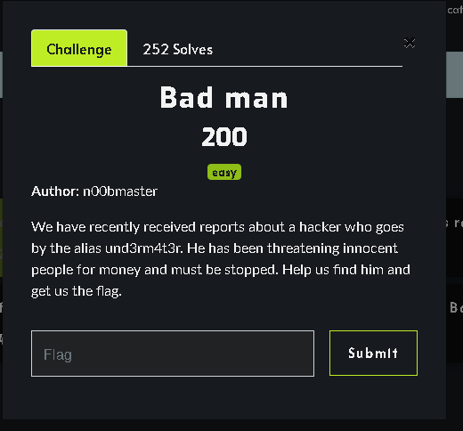
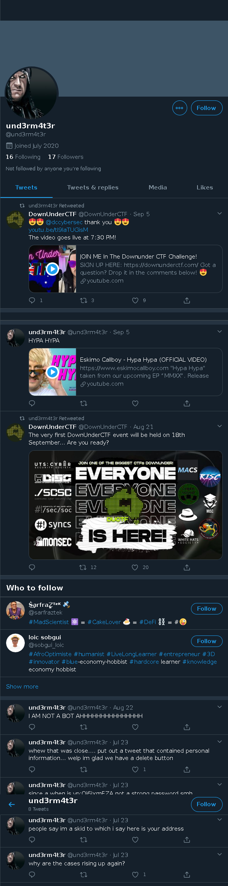
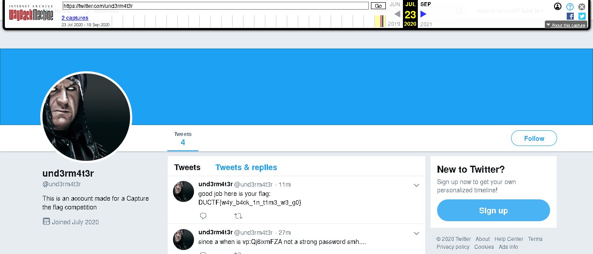

# Bad Man
OSINT

solves 252 

## Challenge



## Solution

This was an interesting OSINT (Open Source Intelligence) challenge that i really enjoyed solving.

As per the description we are given an Alias ```und3rm4t3r```

using sherlock-project we can check for the username on various platforms

# Installing Sherlock
# clone the repo
$ git clone https://github.com/sherlock-project/sherlock.git

# change the working directory to sherlock
$ cd sherlock

# install the requirements
python3 -m pip install -r requirements.txt

....
then 

```python3 sherlock.py und3rm4t3r```

we got several hits but the most interesting was 
```https://twitter.com/und3rm4t3r```



aha well no Flag this time! hmm 

....
but there comes WayBackMachine (archive.org)... must be this huh!

well yes visiting the twitter link on archive.org we get the flag!!



Flag : DUCTF{w4y_b4ck_1n_t1m3_w3_g0}