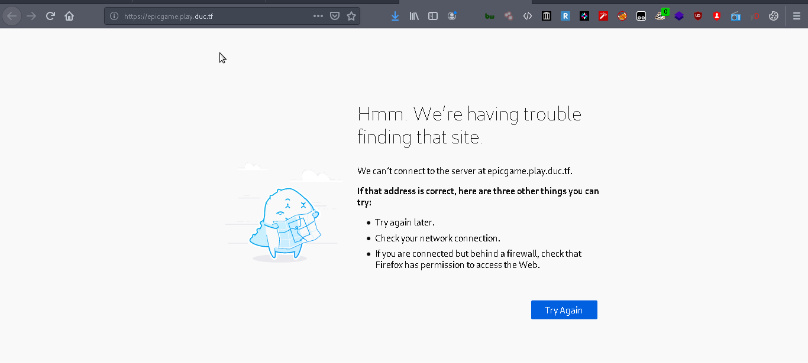

# Web Badmin
Web
Solves 68
## Challenge


## Solution

following the provided challenge link
```https://chal.duc.tf:30102```
we are met with the following web page


that ain't good :(

some recon and by viewing source we get a hint, another link commented out


following the link 
```https://epicgame.play.duc.tf```

we are met with the following error



aha why so??

....
decided to search around, came across two interesting ways to solve the challenge

using ```dig``` and ```host``` commands and reading the DNS TXT records


```dig epicgame.play.duc.tf``` and we get the flag


```host -t txt epicgame.play.duc.tf``` also gives us the flag

Flag : DUCTF{wait_im_confused_what_are_record_types_in_DNS???}
