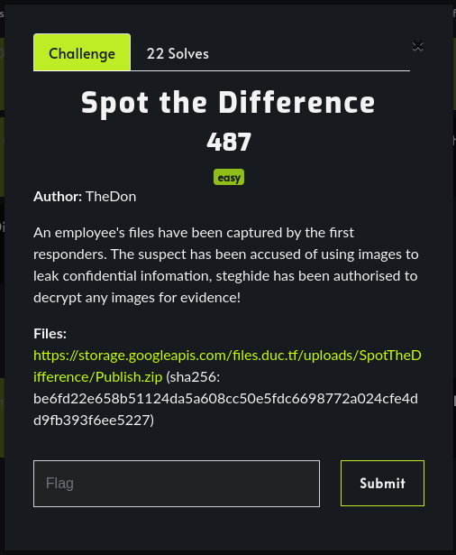
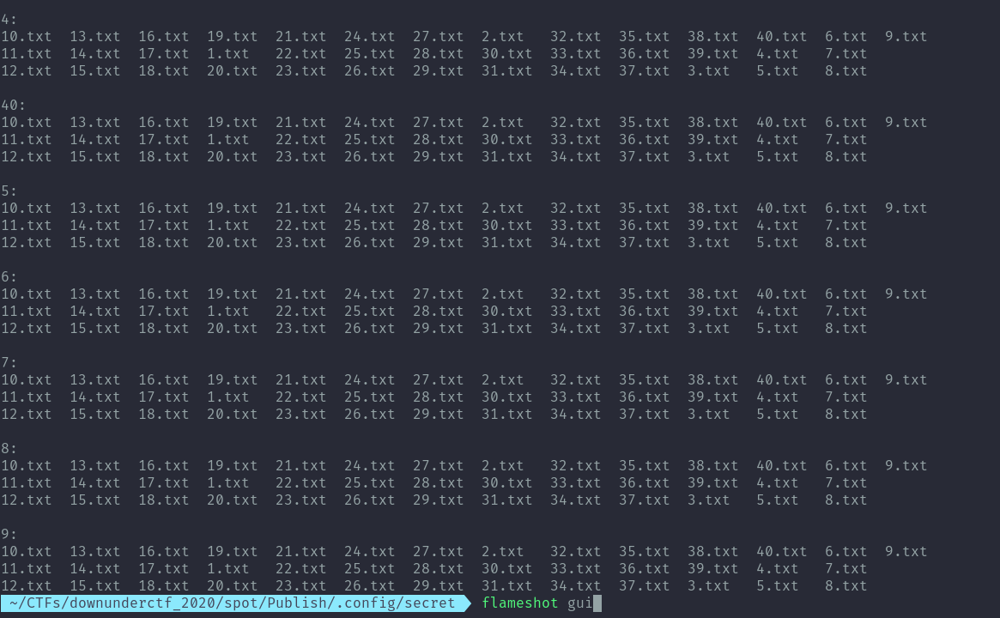
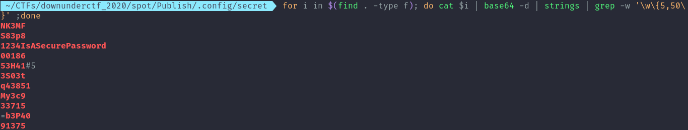
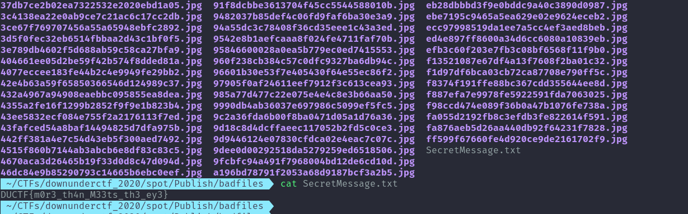

# Spot the Difference

Category: forensics

Challenge Description:



After downloading the provided zip file and decompressing it we get the following folder structure.
```
.
├── badfiles
│   ├── 008532319cb53713de8ef1c979ab526d.jpg
│   ├── 010bd1036defc5c5df774b48ad86f346.jpg
     ---snip---
│   ├── f98ccd474e089f36b0a47b1076fe738a.jpg
│   ├── fa055d2192fb8c3efdb3fe822614f591.jpg
│   ├── fa876aeb5d26aa440db92f64231f7828.jpg
│   └── ff599f67660fe4d920ce9de2161702f9.jpg
├── .config
│   ├── Reminder.png
│   ├── Reminder.zip
│   └── secret
├── Downloads
│   └── DownUnderCTF _ FAQs.pdf
├── Images
│   ├── 1onp4t.jpg
│   ├── download.jfif
│   ├── NPC_wojak_meme.png
│   └── p072ms6r.jpg
├── Messages
│   └── Annotation 2020-09-10 184734.png
├── Music
│   └── EhD-T_UUwAAYjx1.jfif
└── Videos
    └── tenor.gif

8 directories, 212 files
```
Based on the description we are supposed to use steghide to extract information from the images in badfiles directory.

After looping through each of them with an empty passphrase there was no luck. 

Looking through the rest of the directories. Under .config there is a secret directory with a lot of txt files with base64 encoded content. 



After decoding a few of them which ended up being just garbage data, I used this command to loop through each one of them and grep out any word longer than 5 chars.

```sh
for i in $(find . -type f); do cat $i | base64 -d | strings | grep -w '\w\{5,50\}' ;done
```



Then using that 1234IsASecurePassword as the passphrase with steghide with the command below resulted in getting the flag in SecretMessage.txt that was hidden in one of the many images.

```sh
for i in $(find . -type f); do steghide extract -q -p '1234IsASecurePassword' -sf $i;done
```


flag: DUCTF{m0r3_th4n_M33ts_th3_ey3}


