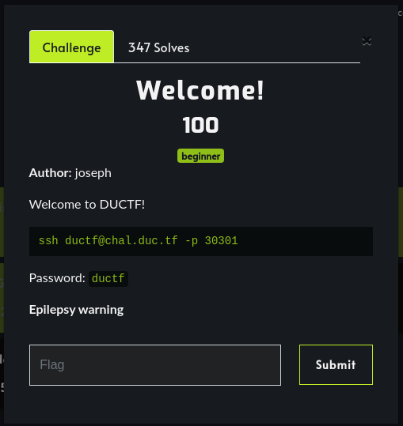
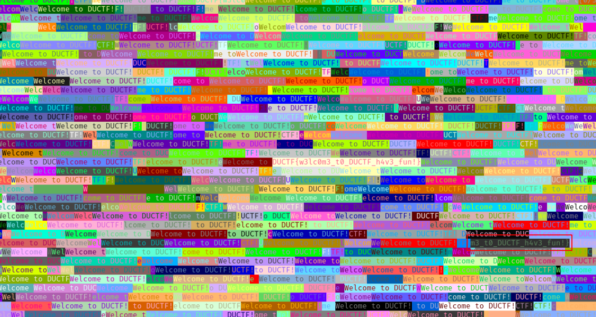
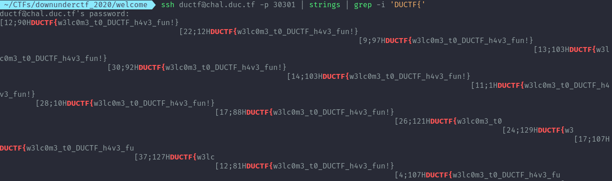

# Welcome! 

Category: Misc

Challenge Description:



Once you ssh into the host you only receive this messages filling the terminal with no way to interact. But after looking at the messages the flag is sort of printed at some point.



We can grep it from the output using this command and get the flag.

```sh
ssh ductf@chal.duc.tf -p 30301 | strings | grep -i 'DUCTF{'
```




